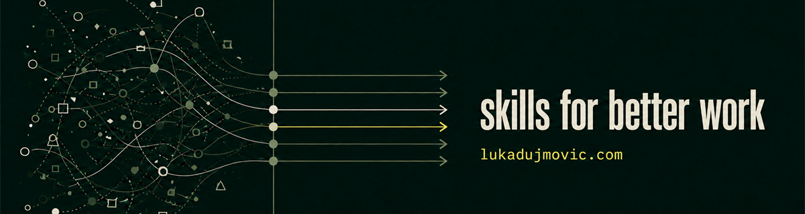

<p align="center">
  
</p>

# Skills for Better Work

Practical AI skills for turning complex work into clearer decisions, better systems, and AI that earns its place.

The skills can also be used with Claude and other AI systems that support reusable instructions and referenced files. They are built, tested, and maintained natively for Codex, which is the best-supported environment and recommended for the most reliable results.

Built by [Luka Dujmovic](https://lukadujmovic.com/) around a simple principle: understand the work first, then build what helps people do it better.

> **Status:** Private alpha. This repository is being prepared for a later public release. Do not share confidential company, customer, employee, security, or process information in prompts, examples, issues, or discussions.

## Compatibility

The packages use Markdown instructions, referenced guidance, and machine-readable schemas so their methods can travel across capable AI systems. Each system loads instructions and exposes tools differently, so Claude and other integrations may require different installation paths, invocation syntax, or permissions. Check the behavior before using a skill for consequential work.

Codex is the reference implementation. The documented installation, automated validation, and behavioral evaluation are maintained for Codex first.

## Available skill: Process Before Platform

`process-before-platform` guides a stakeholder through structured initial discovery so an internal tooling or automation request reaches an initiative queue with enough context to understand, route, and assess it.

Its default is simple: stabilize, simplify, and standardize the process before tooling. That default is not absolute. When evidence shows that a tool must enable a new process, the skill can recommend a bounded process-and-tool experiment.

The skill asks whether the process and initiative are necessary, maps the manual workflow, produces a BPMN-style Mermaid swimlane diagram when that map is supported, inventories existing systems and information sources, exposes codified and person-held knowledge, separates evidence from assumptions, compares the required solution ladder, exposes lifetime ownership, and prepares a portable handoff for an initiative, product, automation, or business-analysis team.

It does not approve initiatives, procurement, budgets, vendors, or architecture.

## Use it

The skill is intentionally explicit-only. Invoke it by name:

```text
Use $process-before-platform to evaluate this internal tooling request:

[Paste a sanitized request or describe the situation.]
```

The skill runs an adaptive questionnaire first. It asks one primary question per round and does not emit JSON while answers are still being collected. Once the questionnaire is complete—or the requester explicitly closes it with remaining unknowns recorded as evidence tasks—it writes two sibling files under `<current-project>/output/process-before-platform/`:

- a ticket-ready Markdown initiative request;
- a vendor-neutral JSON initiative packet conforming to schema version 2.1.0;
- an evidence-gated BPMN-style Mermaid process diagram embedded in Markdown and preserved as source in JSON;
- visible facts, assumptions, unknowns, and evidence tasks;
- a comparison of credible process and technology options;
- an ownership and total-cost view where inputs support it;
- a current direction, confidence, caveats, and blocking conditions.

The artifacts are generated once at the end of the completed questionnaire, not at invocation or after every answer. Existing files are never overwritten. Target-system field mappings are included only when exact metadata is known, and the skill never creates the remote ticket without a separate explicit request.

See the [synthetic approval-portal walkthrough](skills/process-before-platform/examples/synthetic-approval-portal/README.md) for a complete example.

## Install for Codex

Copy the skill folder into your Codex skills directory, then restart or reload Codex if needed.

PowerShell:

```powershell
Copy-Item -Recurse .\skills\process-before-platform "$env:USERPROFILE\.codex\skills\process-before-platform"
```

macOS or Linux:

```bash
cp -R ./skills/process-before-platform ~/.codex/skills/process-before-platform
```

## Repository map

- `skills/process-before-platform/` — installable skill, references, schema, icons, and example.
- `evals/` — synthetic behavioral cases and the manual forward-test protocol.
- `scripts/validate.py` — dependency-free structural and contract validation.
- `tests/` — regression tests for the validator and example packet.
- `launch/` — private-alpha publication checklist, milestone series, and release-post draft.

## Validate

With Python 3.11 or newer:

```bash
python scripts/validate.py
python -m unittest discover -s tests
```

The validator checks the skill package, links, JSON Schema subset, aligned synthetic Markdown and JSON initiative artifacts, BPMN-style diagram evidence and step coverage, required solution-ladder coverage, system references, score calculations, and evaluation fixture structure. Behavioral quality still requires forward-testing the skill against the cases in `evals/`.

## Feedback

Use the issue templates for reproducible behavior problems and method proposals. Describe only synthetic or fully sanitized situations. Never paste a real internal request, generated initiative packet, vendor document, or screenshot unless you have authority to make every detail public.

GitHub Discussions and a private feedback channel are deliberately deferred until publication and demonstrated need.

## License

Apache License 2.0. See [LICENSE](LICENSE).
