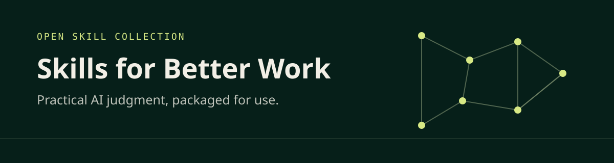

<p align="center">
  
</p>

# Skills for Better Work

Practical Codex skills that help people make better decisions about work, systems, and AI.

> **Status:** Private alpha. This repository is being prepared for a later public release. Do not share confidential company, customer, employee, security, or process information in prompts, examples, issues, or discussions.

## First skill: Process Before Platform

`process-before-platform` helps a stakeholder examine an internal tooling or automation request before a team commits to a solution.

Its default is simple: stabilize, simplify, and standardize the process before tooling. That default is not absolute. When evidence shows that a tool must enable a new process, the skill can recommend a bounded process-and-tool experiment.

The skill asks whether the process is necessary, separates evidence from assumptions, compares the full solution ladder, exposes the lifetime ownership of custom software, and prepares a handoff for a product or automation team.

It does not approve initiatives, procurement, budgets, vendors, or architecture.

## Use it

The skill is intentionally explicit-only. Invoke it by name:

```text
Use $process-before-platform to evaluate this internal tooling request:

[Paste a sanitized request or describe the situation.]
```

The default result contains:

- a readable decision and handoff brief;
- a versioned JSON decision packet;
- visible facts, assumptions, unknowns, and evidence tasks;
- a comparison of credible process and technology options;
- an ownership and total-cost view where inputs support it;
- a current direction, confidence, caveats, and blocking conditions.

See the [synthetic approval-portal walkthrough](skills/process-before-platform/examples/synthetic-approval-portal/README.md) for a complete example.

## Install locally

Copy the skill folder into your Codex skills directory, then restart or reload Codex if needed.

PowerShell:

```powershell
Copy-Item -Recurse .\skills\process-before-platform "$env:USERPROFILE\.codex\skills\process-before-platform"
```

macOS or Linux:

```bash
cp -R ./skills/process-before-platform ~/.codex/skills/process-before-platform
```

## Repository map

- `skills/process-before-platform/` — installable skill, references, schema, icons, and example.
- `evals/` — synthetic behavioral cases and the manual forward-test protocol.
- `scripts/validate.py` — dependency-free structural and contract validation.
- `tests/` — regression tests for the validator and example packet.
- `launch/` — private-alpha publication checklist, milestone series, and release-post draft.

## Validate

With Python 3.11 or newer:

```bash
python scripts/validate.py
python -m unittest discover -s tests
```

The validator checks the skill package, links, JSON Schema subset, synthetic decision packet, score calculations, and evaluation fixture structure. Behavioral quality still requires forward-testing the skill against the cases in `evals/`.

## Feedback

Use the issue templates for reproducible behavior problems and method proposals. Describe only synthetic or fully sanitized situations. Never paste a real internal request, generated decision packet, vendor document, or screenshot unless you have authority to make every detail public.

GitHub Discussions and a private feedback channel are deliberately deferred until publication and demonstrated need.

## License

Apache License 2.0. See [LICENSE](LICENSE).
