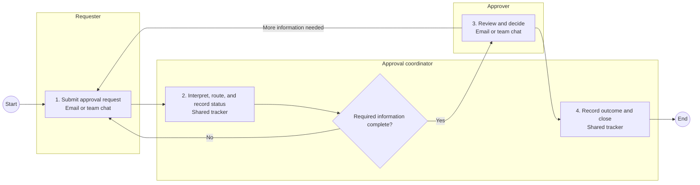
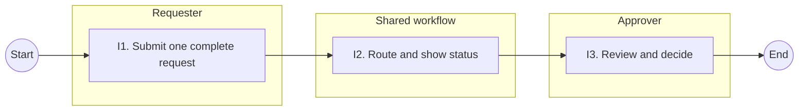
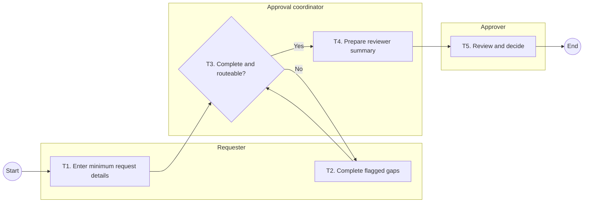

# Review handoff: synthetic approval portal, iteration 1

## Decision snapshot

The contained prototype is technically and synthetically verified, but no representative coordinator or approver has attempted the target job. The recommendation is `retest`; this iteration is waiting for human evidence, not complete.

## Process-design basis

### Current state — observed and evidence-gated

### Stated ideal — stakeholder aspiration

### Proposed target — design hypothesis

The original portal request `must-split` because it combines requester intake, coordinator routing, approval, status tracking, and audit concerns with different users and failure modes. The selected slice is only T1–T4: requester-to-coordinator completeness and reviewer-summary preparation, and it `fits-one-slice`. Approval, policy authoring, later status tracking, audit, and production integration are excluded.

## Prototype and evidence

Open `prototype/index.html` and attempt SCN-1, SCN-2, and SCN-5. Code was justified because the accepted uncertainty required field-level feedback, routing, refusal, and a copyable handoff. Technical and synthetic checks passed; representative-user usability and business outcomes remain unproven.

## Review tracks

- Business: confirm that intake is the earliest material failure, validate human control and exception handling, and nominate a coordinator and approver.
- PM/PO: review problem traceability, role separation, slice boundaries, and whether the evidence plan is sufficient.
- Delivery: assess existing-capability fit and dependencies only after the process and slice are accepted.

## Ready-to-run user session

Timebox: 30 minutes. Ask a coordinator to prepare a summary from a complete request, resolve an incomplete request, and hand the result to an approver. Do not explain fields or routing before the attempt. Record completion without coaching, wrong routes, hesitation, and missing reviewer context. Stop if the prototype appears to approve, sensitive data is entered, or the summary cannot start a review.

Resume the loop by appending sanitized representative `user-observation` sessions to the proof, rerunning validation, and choosing `stop`, `adapt-prototype`, `retest`, or `prepare-pilot-review` from the evidence.

## What may be missing or uncertain

No representative user has attempted the job. Final category rules, exception escalation, process ownership, system-of-record choice, access constraints, and existing-tool fit remain unresolved.
