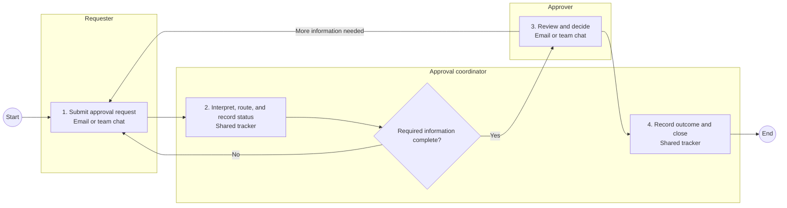

# Standardize internal approval requests before tooling

## Initiative summary and fit

- Classification: `discovery-needed`
- Readiness: `ticket-ready` for a discovery request
- Suggested request type: `discovery`
- Requester: Operations requester
- Business owner: Pending discovery
- Business areas: Operations and four submitting departments
- Reach: Cross-functional
- Initiative type: Process optimization
- Proposed solution: Custom internal approval portal

Four departments submit approval requests through email and team chat, while a coordinator manually records status in a shared tracker. Definitions, routes, exceptions, and ownership differ, causing lost status and rework. The immediate request is to define a minimum approval model and test existing capability before selecting or building a portal.

## Problem, necessity, and desired outcome

Requesters, coordinators, and approvers cannot reliably see or follow one request-to-decision flow. Some approval outcome appears necessary, but the basis for each route has not been supplied. The desired outcome is a traceable, consistently defined process using the simplest sustainable capability.

## Scope

In scope:

- Define the minimum request and approval model.
- Clarify mandatory approvals and legitimate exceptions.
- Assess the owned work-management suite against that model.
- Recommend a process and technology direction.

Out of scope:

- Production implementation, architecture or procurement approval, and organization-wide rollout.

## Current manual process

1. A requester sends a department-specific request through email or team chat.
2. The approval coordinator interprets it, chooses a route using policy pages and experience, and manually records status in a shared tracker.
3. An approver reviews the message and supporting details, then decides or asks for more information.
4. The coordinator communicates or records the outcome and closes the tracker entry.

Material handoffs occur between requester, coordinator, and approver. Department-specific routes, missing information, and alternate approvers create exceptions and rework. The tracker and the conversation can diverge. No end-to-end process owner is named.

### BPMN-style current-process diagram

This is a BPMN-style Mermaid view, not BPMN 2.0 XML. It shows the supported normal flow and material rework loops. Department-specific approval routes and alternate-approver branches remain summarized because their rules are not yet confirmed.

## Existing systems and information sources

| System | Current use | Information collected or retrieved | Source-of-truth role | Transfers and limitations |
| --- | --- | --- | --- | --- |
| Email or team chat | Submit requests, clarify them, and communicate decisions | Request content, sender, recipients, message history, decision | Original conversation history | The coordinator manually copies status into the tracker; structure and visibility vary |
| Shared tracker | Record request status and outcome | Request identifier, department, approver, status, outcome | Intended operational status; authority remains unclear | Manual updates can diverge from the conversation |
| Owned work-management suite | Potential forms, approval, access, and audit capability | Not assessed | None established | Fit has not been tested against a minimum approval model |

The only confirmed material flow is a manual transfer of request, approver, status, and outcome from email or chat into the shared tracker.

## Knowledge landscape

| Knowledge | Location | Codification | Use | Ownership and gaps |
| --- | --- | --- | --- | --- |
| Department approval policy pages | Department document spaces | Partially codified | Criteria, approvers, and required information | Owner, currency, review practice, and common minimum are unknown |
| Coordinator and approver judgment | Individual experience | Tribal | Ambiguous routing, exceptions, and substitute approvers | Not consistently transferable and may conflict with written pages |

## Target state and requirements

The target requires structured intake, rule-based normal routing, explicit exception handling, visible status, and a decision audit trail. A policy owner must approve the minimum process and authorized approvers must retain decision accountability. Access and audit constraints remain pending.

## Value, priority, and success measures

Potential value includes reduced coordination and rework, lower operational risk, better job outcomes, and improved service health. Monetary value, saved-time use, strategy linkage, urgency, deadline, and budget are pending discovery.

Candidate measures are visible request status, rework caused by missing information, and request-to-decision time. Their baselines, targets, evidence windows, and owners remain pending.

## Required solution assessment

Current direction: `process-redesign` with medium confidence.

- Eliminate or stop: deferred; individual approvals may still be unnecessary.
- Process redesign: plausible and leading.
- Existing capability: plausible after the minimum process is defined.
- Buy or configure: deferred until existing capability is assessed.
- Integrate or automate: deferred until stable steps and sources of truth exist.
- Custom build: rejected for the current stage because differentiation and lifecycle ownership are not established.
- Co-evolve through experiment: deferred; technology is not yet shown to be necessary for learning the process.
- Insufficient evidence: not leading; enough evidence exists to begin process discovery.

Requester scorecard weights are unassigned, so aggregate scores and evidence-completeness percentages remain uncalculated.

## Dependencies, risks, and lifetime ownership

- The missing process owner blocks rule and exception decisions.
- Partly codified and person-held knowledge may conflict or be stale.
- Untested existing capability creates a risk of buying or building duplicate functionality.
- Product/process decisions, configuration or development, security, integration, QA, deployment, monitoring, incidents, support, change, documentation, upgrades, and retirement remain unowned.
- Inputs are insufficient for a monetary ownership estimate.

## Evidence tasks and pending discovery

1. Confirm mandatory approval outcomes and controls with accountable owners.
2. Define the minimum stable model from sanitized recent cases.
3. Test the owned work-management suite against that model.
4. Name the business and end-to-end process owner.
5. Confirm strategy linkage, budget status, and measurable baselines if required by the receiving queue.

## Ticket handoff

Ticket title: **Standardize internal approval requests before tooling**

Investigate and standardize the cross-functional approval-request process before selecting software. Requests currently arrive through email and team chat, a coordinator manually records status in a shared tracker, routes and exceptions vary, policy knowledge is only partly codified, and no end-to-end owner is named. Discovery should confirm mandatory controls, define the minimum request and approval model, identify accountable ownership, and test the owned work-management suite. Do not approve a custom portal until differentiation and full lifecycle ownership are evidenced.

The packet is ready for a discovery queue, not initiative approval or implementation. No target ticket system or field mapping was requested.

Next human decision: assign the process owner and approve a short discovery to define the minimum model and test existing capability.

## What may be missing or uncertain

The volume is an estimate. No policy source, owner, system-capability test, strategy link, budget, or validated baseline was supplied. The findings do not approve procurement, architecture, budget, or delivery.
